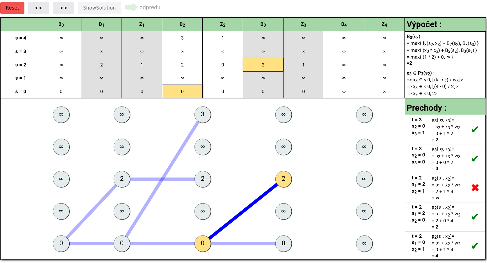
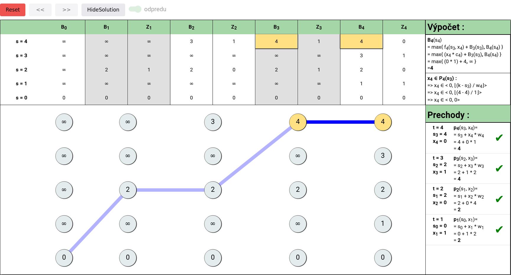

# Dynamicp programming visualizer 

A small visualization helper for certain DP calculations.

## Installation

This project is build in Angular, to run locally : 

```bash
ng serve visualizer
```

## Examples




